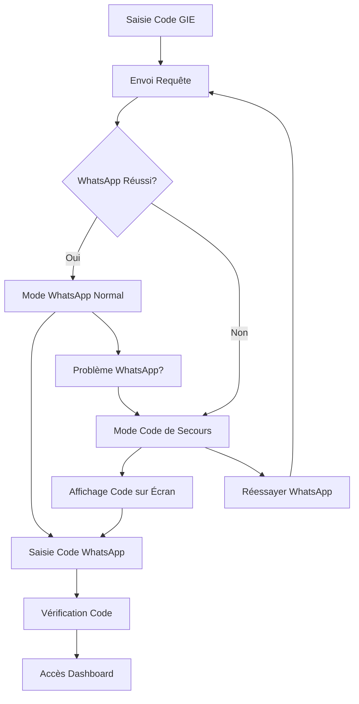

# 🔐 Système de Codes de Secours - WalletLogin

## 📋 Fonctionnalités Ajoutées

Le composant `WalletLogin` a été amélioré pour gérer automatiquement les échecs d'envoi de codes par WhatsApp en affichant le code directement sur l'écran.

## 🎯 Scénarios Gérés

### 1. **Envoi WhatsApp Réussi** ✅
- Le code est envoyé par WhatsApp normalement
- L'utilisateur voit une notification verte de succès
- Un code de secours peut également être affiché en bas (optionnel)

### 2. **Envoi WhatsApp Échoué** ⚠️
- Le serveur retourne `whatsappSent: false`
- Le code est automatiquement affiché sur l'écran
- Interface orange/ambre pour indiquer le mode de secours
- Message explicatif pour l'utilisateur

### 3. **Erreur de Connexion** 🛟
- En cas d'échec complet de la requête
- Un code temporaire est généré localement
- L'utilisateur peut continuer le processus

### 4. **Basculement Manuel** 🔄
- Bouton "Problème avec WhatsApp ?" pour forcer l'affichage du code
- Bouton "Réessayer l'envoi WhatsApp" pour revenir au mode normal

## 🏗️ Structure Technique

### Nouvelles Variables d'État
```typescript
const [backupCode, setBackupCode] = useState('');     // Code de secours
const [whatsappFailed, setWhatsappFailed] = useState(false); // État d'échec WhatsApp
```

### Réponse API Attendue
```json
{
  "success": true,
  "data": {
    "whatsappNumber": "+221 7X XXX XX XX",
    "whatsappSent": false,           // Nouveau: indique si WhatsApp a réussi
    "backupCode": "123456"           // Code de secours à afficher
  }
}
```

## 🎨 Interface Utilisateur

### Mode WhatsApp Réussi
- **Couleur**: Vert (success)
- **Icône**: MessageCircle
- **Message**: "Code envoyé avec succès"
- **Action**: Vérifier WhatsApp

### Mode Code de Secours
- **Couleur**: Orange/Ambre (warning)
- **Icône**: Shield
- **Message**: "Code de sécurité temporaire"
- **Affichage**: Code en grand format avec police mono

### Fonctionnalités Visuelles
- Code affiché en **police monospace** avec espacement
- **Bordure colorée** selon le mode (vert/orange)
- **Animations** fluides entre les modes
- **Boutons contextuels** pour basculer

## 🔄 Flux de Fonctionnement



## 🧪 Comment Tester

### Test Automatique (Développement)
1. Modifier temporairement la réponse API pour retourner `whatsappSent: false`
2. Saisir un code GIE valide
3. Vérifier que le code s'affiche sur l'écran

### Test Manuel
1. Utiliser le bouton "Problème avec WhatsApp ?"
2. Observer le basculement vers le mode code de secours
3. Tester la saisie du code affiché

### Test de Résilience
1. Couper la connexion réseau lors du renvoi de code
2. Vérifier qu'un code temporaire est généré
3. Tester que l'utilisateur peut continuer

## 📱 Compatibilité

- **Mobile**: Interface responsive adaptée aux petits écrans
- **Desktop**: Affichage optimal sur grands écrans
- **Accessibilité**: Contrastes et tailles de police appropriés
- **Navigation**: Support clavier complet

## 🔧 Configuration Backend

Pour que cette fonctionnalité fonctionne, le backend doit :

1. **Tenter l'envoi WhatsApp** et détecter les échecs
2. **Retourner le statut** dans `whatsappSent`
3. **Fournir un code de secours** dans `backupCode`
4. **Accepter les codes de secours** lors de la vérification

## 🚀 Avantages

- **Continuité de service** même si WhatsApp échoue
- **Expérience utilisateur** sans interruption
- **Debugging facilité** avec codes visibles
- **Résilience** face aux problèmes réseau
- **Flexibilité** avec basculement manuel

---

**✨ Le système garantit maintenant qu'aucun utilisateur ne sera bloqué par un problème d'envoi WhatsApp !**
